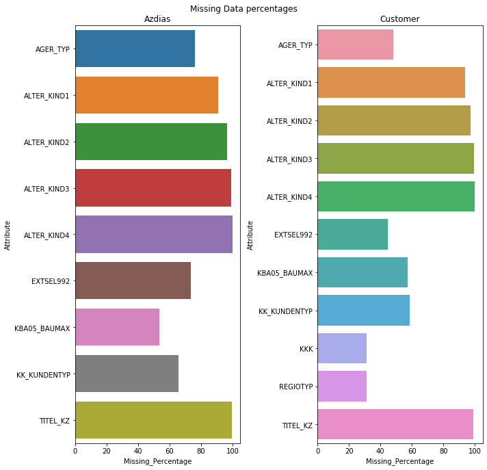
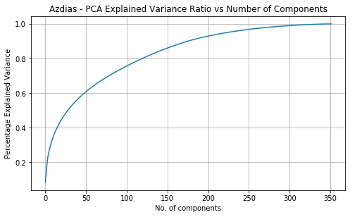
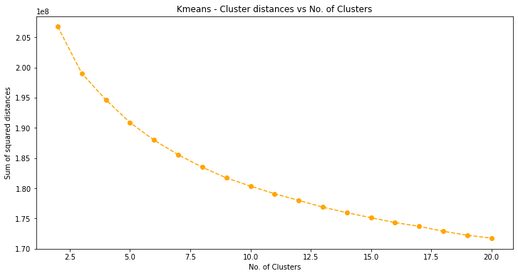
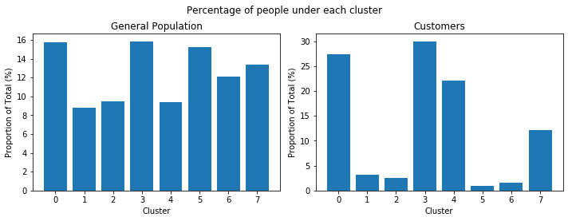
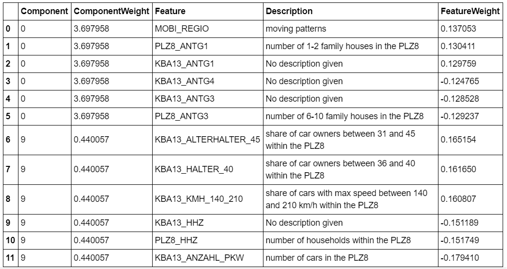
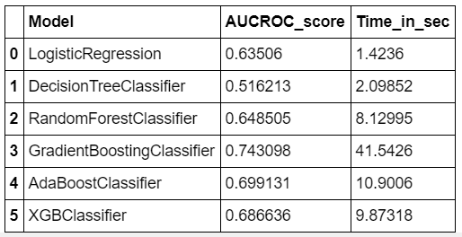
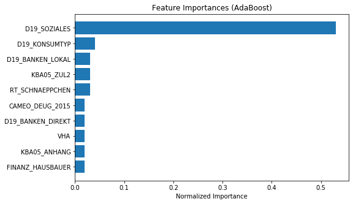
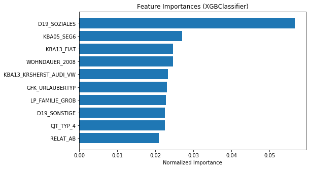

# Arvato Customer Segmentation Report 

### Data Scientist Nano Degree

## Table of Contents

- [1. Project Definition](#project_definition)
  - [Project Overview](#project_overview)
  - [Problem Statement](#problem_statement)
  - [Metrics](#metrics)
- [2. Analysis](#analysis)
  - [Data Exploration and Preprocessing](#exploration)
- [3. Methodology](#methodlogy)
  - [Customer Segmentation](#segmentation)
  - [Customer Acquisition](#acquisition)
- [4. Result and Prediction](#result)
- [5. Conclusion](#conclusion)
  - [Reflection](#refection)
  - [Improvment](#improvment)

## 1. Project Definition

### Project Overview

- **Domain Background**

Arvato is a services company that provides financial services, Information Technology (IT) services and Supply Chain Management (SCM) solutions for business customers on a global scale. In this project, Arvato is helping a Mail-order company, which sells organic products in Germany, to understand its customers segments in order to identify next probable customers. 

The existing customer data and the demographic data of population in Germany are to be studied to understand different customer segments, and then building a system to make predictions on whether a person will be a customer or not based on the demographic data.

- **Dataset and Inputs**

There are four data files associated with this project:

1. `Udacity_AZDIAS_052018.csv`: Demographics data for the general population of Germany; 891 211 persons (rows) x 366 features (columns).
- `Udacity_CUSTOMERS_052018.csv`: Demographics data for customers of a mail-order company; 191 652 persons (rows) x 369 features (columns).
- `Udacity_MAILOUT_052018_TRAIN.csv`: Demographics data for individuals who were targets of a marketing campaign; 42 982 persons (rows) x 367 (columns).
- `Udacity_MAILOUT_052018_TEST.csv`: Demographics data for individuals who were targets of a marketing campaign; 42 833 persons (rows) x 366 (columns).

Additionally, 2 metadata files have been provided to give attribute information:

1. `DIAS Information Levels - Attributes 2017.xlsx`: top-level list of attributes and descriptions, organized by informational category
- `DIAS Attributes - Values 2017.xlsx`: detailed mapping of data values for each feature in alphabetical order

### Problem Statement

The problem statement can be formulated as, “Given the demographic data of a person, how can a mail order company acquire new customers in an efficient way”.

First, the demographic data of the general population and the customers is be studied with the help of unsupervised learning algorithms. The goal in this step is to identify segments in general population and segments in the existing customers, and then discovering what demographic features correspond to a person being a customer for the mail-order company.

Second, a supervised learning algorithm is be used to make predictions on whether a person is a probable customer or not, based on the demographic data.

### Metrics
The project is divided into two parts

**Customer Segmentation using unsupervised learning algorithms:**
this part of the project uses an unsupervised learning algorithm like K-Means Clustering is proposed. Also, in this case the number of clusters is selected on the squared error i.e. the distance between all the clusters with the help of an elbow plot.

**Customer Acquisition using supervised learning algorithms：**
the task of the second part is to predict whether or not the mail-order company should approach a customer. Here the given training data will be split into train and evaluation sets, the model will be trained on the training split and will be evaluated on the evaluation split. In this step Area Under Receiver Operating Characteristic (AUROC), has been selected as an evaluation metric.

## 2. Analysis

### Data Exploration and Preprocessing
We checked dataset for integrity which contain the expected number of rows and columns as per description. The preprocessing is done step by step as follows:

**a. Addressing mixed type columns**: 
we addressed the issue that columns 18 and 19 contained mixed features. We also replaced the mis-recorded values with NaN values in the dataframe.

**b. Addressing ‘unkown’ values**:
In total, there were 232 columns which contained unknown representations. All these unknown values are replaced with NaN values in the dataframes.

**c. Addressing non-existent values in `LP_*` columns**:
The columns `LP_FAMILIE_FEIN` and `LP_STATUS_FEIN` have been dropped since they contained duplicate information that the corresponding `_GROB` columns consisted. Other columns containing ‘0’s have been converted to NaN values.

**d. Re-encoding features**:
We re-encoded columns `ANREDE_KZ` and `CAMEO_INTL_2015`. Column `EINGEFUGT_AM` has been transformed to datetime. ID column `LNR` has been dropped.

**e. Addressing missing values**: The columns that had more than 30% missing values were dropped from both customers data and general population data. All 11 columns that have been dropped are shown in Figure 1. In addition, all the observations with more than 50 missing features are dropped in this step. The remaining missing values have been replaced with the most frequently occurred observation in each feature.

Figure 1: Columns with more than 30% missing values

**f. Feature scaling**:
A standard scaler is used to bring all the features to the same range. This is done in order to eliminate feature dominance when applying dimensionality reduction.

## 3. Methodology

### Customer Segmentation

- **Principal Component Analysis (PCA)**

The first part of the project is aimed to divide the general population and the customers into different segments. Since there were 353 features after the data cleaning and feature engineering step, a Principal Component Analysis (PCA) was performed on the given data to reduce the number of dimensions. 

Figure 2: PCA Explained Variance plot

As seen in the resulting explained variance plot Figure 2, although we have 353 features, almost 90% of the variance in the data can be explained with the help of 150 components of PCA. With this step we will be able to reduce the number of features from 353 to 150.

- **K-Means Clustering**

After the dimensionality reduction, the next step is to divide the general population and customer population into different segments. K-Means clustering algorithm has been chosen for this task. We use an elbow plot (Figure 3) to decide the number of clusters for the K Means algorithm. The optimal number of clusters is chosen to be 8, since the sum of squares of distances stops decreasing at a higher rate at this point as shown in Figure 7.

Figure 3: K-Means elbow plot

Figure 4 represents the proportions of population coming into each cluster. The cluster distribution of the general population is uniform, meaning that the general population has been uniformly clustered into 8 segments. But the customer population seems to be coming from the clusters 0, 3, 4 and 7.

Figure 4: Cluster proportions

- **Cluster Analysis**

We can understand each cluster by analysing what components make up each cluster and what main features make up these components. An example is shown in Figure 5.

As seen in Figure 5, the to two components that make up this cluster ‘0’ and ‘9’. That means this cluster corresponds to people who like to live in neighbourhoods having a smaller number of houses and the houses with a smaller number of families, which can be seen from the feature weights given to the corresponding feature in each component. Also, these people tend to live in neighbourhoods which have 31-40 car owners (seen from component 9 feature weights) and like to live where there are a smaller number of cars (seen from last element in the table).

Figure 5: Cluster 3 – Component Analysis

### Customer Acquisition

- **Benchmark**

The second part of the project is to use supervised learning algorithms to predict whether a person will be a customer or not based on the demographic data.We use logistic regression model first and get **0.63** (AUROC score) as a benchmark

- **Baseline Performance**

After setting the benchmark, the data has been scaled with the standard scaler and is split into training and validation split. Different algorithms have been trained on the training split and have been evaluated on validation split.

Figure 6: Performance comparison

Figure 11 compares perfromance of different models. The ensemble algorithms outperform all the other models in this case. Random Forest Classifier has a good score and the Gradient Boosting Classifier from the sklearn library has the highest score but the training time for this is higher than any other model. The AdaBoost Classifier and XG Boost classifier have almost similar performance and high score, also can be trained in less amount of time. So, these two algorithms have been selected for the hyperparameter tuning step.

- **Hyperparameter Tuning**

Adaboost and XGBoost classifiers have been tuned with the help of a Grid Search. A set of hyperparameters for both the algorithms have been selected for tuning and a grid search has been performed for both the algorithms to determine the best performing model.

Figure 7: Adaboost Feature Importance

Figure 8: Performance comparison

The feature importances for Adaboost model is shown in Figure 12 and for XGBoost model is shown in Figure 13. Both the algorithms have given the highest importance to `D19_SOZIALES` feature. There is no description given in the attribute information files. But as the name suggest and looking at other features with `D19_` as a start, it seems that the feature has something to do with social transactions (this is an assumption and might differ from actual feature description).

- **Justification**

The feature importances with the XGboost model seem to be well distributed when compared to AdaBoost model. This might be due to the way these algorithms are designed, Adaboost improves upon weak learners by identifying short comings in the highly weighted data points, where as the XGBoost algorithm improves upon the weak learners with the help of gradients coming from an objective function.

## 4. Result and Prediction

After the hyperparameter tuning, the performance on the validation data with best models resulted in an improvement. The score is shown in the table 1.

Figure 8: Performance comparison

| Model               | AUROC Score |  
| :---:               | :---:       | 
| AdaBoost Classifier | 0.7431   |
| XG Boost Classifier | 0.7478      | 

The final predictions were made on the test data which was provided in the file `Udacity_MAILOUT_052018_TEST.csv`. The same pre-processing steps were performed to clean the data. This data was scaled with the scaler which was fit on the training data.

## 5. Conclusion

Customer segmentation with unsupervised ML models shows that the general population can be divided into 8 clusters.

Most of the Arvato customers belong to cluster 0, 3, 4 7. They have the following characteristics: have moving pattern, be financial ready, have upper middle class cars.These aspects should be taken into consideration in any marketing campaign.

The best model to predict the response of target customers is XGBoost Classifier with mean AUC equals to 0.7478 while AdaBoost Classifier with 0.7431.

### Reflection

At the first stage, an unsupervised modeling technique carried out to segment and classify the general population. This segmentation helped us in finding the common pattern for the target customers. KMeans algorithm used to classify the data points and PCA dimension reduction technique used.

At the second stage, a supervised model was implemented to predict the response of the customers to a mail marketing campaign. The best-performance model were AdaBoosting classifier and XGBoost classifier.

### Improvement
There is still scope for improvement. Future steps include: 

1. Dealing with more categorical features and one-hot encoding them
- Understanding more features and selecting relevant ones
- Balancing the classes by using up-sampling, down-sampling or re-sampling techniques
- Run Randomized search on Hyperparameters on a larger scale

